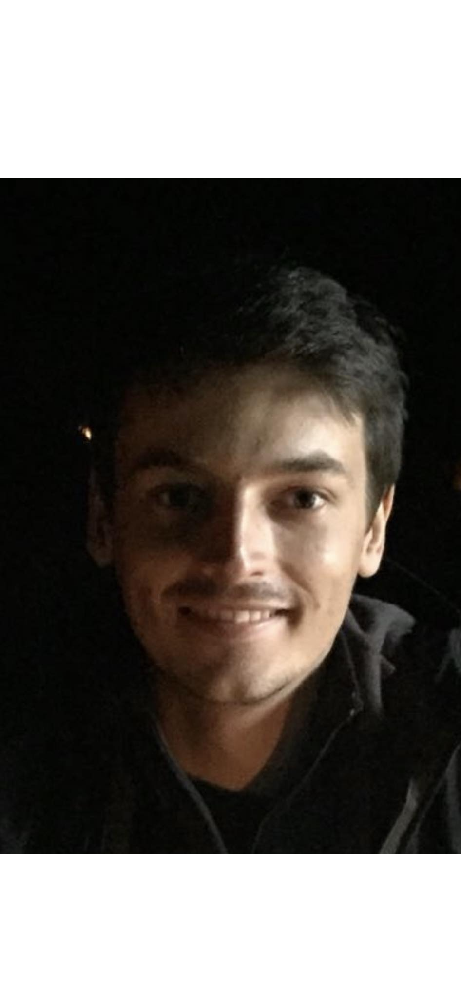

<!-- (comment) the image below can be found in img folder of this very project-->
<!--{: style="float: right; margin: 0px 20px; width: 180px;" name="fox"}-->
{: style="float: right; margin: 0px 20px; width: 180px;" name="profile_pic"}

<!--  -->

I am Alexandre Pasquiou, a __Ph.D. student__ at MIND (Inria) supervised by [Bertrand Thirion]({{site:bertrand_page}}) and [Christophe Pallier]({{site.christophe_page}}). Currently working at [NeuroSpin](https://joliot.cea.fr/drf/joliot/pages/entites_de_recherche/neurospin/participer-a-la-recherche.aspx) in Paris Saclay.

I am doing my Ph.D. at [MIND]({{site:mind_url}}) and [UNICOG]({{site:unicog_url}}) in Computational Neurosciences, at the junction of Machine Learning and Neurosciences.
I work on language and vision processing in deep neural networks and the human brain.

More precisely, during my Ph.D. thesis entitled __Deciphering the Neural Bases of Language Comprehension Using Latent Linguistic Representations__ I mainly focused on understanding how the human brain processes language and how to decode brain activity.

My research interests revolve around machine learning, natural language & vision processing, neural architecture search, neurosciences, and more generally Artificial Intelligence for healthcare & biology.

I previously graduated from <strong>École Centrale Paris</strong> (renamed CentraleSupélec) in 2018, and worked as a research scientist at <a href="https://joliot.cea.fr/drf/joliot/Pages/Entites_de_recherche/NeuroSpin.aspx"><strong>NeuroSpin</strong></a> from March to December 2019.